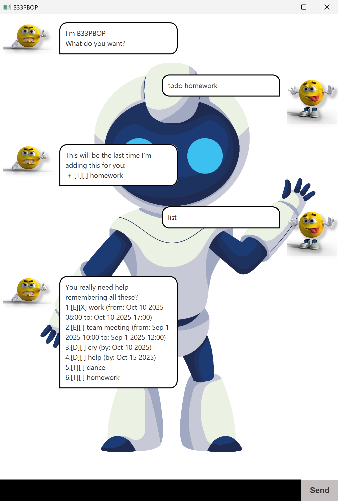

# B33PBOP User Guide


B33PBOP is a personal task and client management chatbot designed for efficient and easy use.
Optimized for the Command Line Interface (CLI), B33PBOP allows you to manage tasks and clients quickly using simple commands, while providing clear feedback.

---

- [Quick Start](#quick-start)
- [Features](#features)
  - [Todo Task](#todo-task-todo)
  - [Deadline Task](#deadline-task-deadline)
  - [Event Task](#event-task-event)
  - [Delete Task](#delete-task-delete)
  - [Find Task](#find-task-find)
  - [Mark Task Complete](#mark-task-mark)
  - [Unmark Task Complete](#unmark-task-unmark)
  - [Add Client](#add-client-client-add)
  - [List Client](#list-client-client-list)
  - [Update Client](#update-client-client-update)
  - [Delete Client](#delete-client-client-delete)
  - [Exit B33PBOP](#exit-b33pbop-bye)


---

## Quick Start

1. Ensure you have Java `17` or above installed in you Computer.  
**Mac users**: Ensure you have the precise JDK version prescribed [here](https://se-education.org/guides/tutorials/javaInstallationMac.html).
2. Download the latest `.jar` file from [here](https://github.com/b33pbop/ip/releases)
3. Copy the file to the folder you want to use as the home folder for B33PBOP.
4. Open the command terminal, `cd` into the folder you put the jar file in, and use the `java -jar B33pbop.jar`  
command to run the application.  
A GUI similar to the above should appear in a few seconds.
5. Type the command in the command box and press Enter to execute it e.g. typing `todo dance` and  
pressing Enter will add a new todo task with description dance to your task list.
6. For more details on available commands, refer to the [Features](#Features) section

---

## Features

B33PBOP handles 2 groups of commands:
1. Task commands - for managing tasks and schedules
2. Client commands - for keeping track of client information

### Todo Task `todo`

Adds a todo task.  

**Format**:
``` bash
todo (task description)
```

**Example**:
``` bash
todo buy food
```

**Expected output**:
``` txt
This will be the last time I'm adding this for you: 
+ [T][ ] buy food
```

### Deadline Task `deadline`
Adds a task with a deadline.

**Format**:
``` bash
deadline (task description) /by (yyyy-MM-dd)
```

**Example**:
``` bash
deadline submit report /by 2025-09-20
```

**Expected output**:
``` txt
This will be the last time I'm adding this for you: 
+ [D][ ] submit report (by: Sep 20 2025)
```

### Event Task `event`

Adds an event with a start and end datetime.

**Format**:
``` bash
event (task description) /from (yyyy-MM-dd) /to (yyyy-MM-dd)
```

**Example**:
``` bash
event math class /from 2025-10-10 13:00 /to 15:00
```

**Expected output**:
``` txt
This will be the last time I'm adding this for you: 
+ [E][ ] math class (from: Oct 10 2025 13:00 to Oct 10 2025 15:00)
```

### Delete Task `delete`

Deletes a task.

**Format**:
``` bash
delete (task index)
```

**Example**:
``` bash
delete 1
```

**Expected output**:
``` txt
Thank god, you should reall keep deleting tasks: 
- [E][X] work (from Oct 10 2025 08:00 to: Oct 10 2025 17:00)
```

### Find Task `find`

Finds tasks based on a given keyword

**Format**:
``` bash
find (keyword)
```

**Example**:
``` bash
find dance
```

**Expected output**:
``` txt
You are really bossy you know that
1.[T][ ] dance
```

### List Tasks `list`

List all tasks.

**Format**:
``` bash
list
```

**Example**:
``` bash
list
```

**Expected output**:
``` txt
You really need help remembering all these?
1.[E][ ] team meeting (Sep 1 2025, 10:00 - 12:00)
2.[D][ ] cry (due by Oct 10 2025)
3.[D][ ] help (due by Oct 15 2025)
4.[T][ ] dance
5.[T][ ] homework
6.[T][ ] buy food
7.[D][ ] submit report (due by Sep 20 2025)
8.[E][ ] math class (Oct 10 2025, 13:00 - 15:00)
```

### Mark Task `mark`

Marks a task as complete

**Format**:
``` bash
mark (task index)
```

**Example**:
``` bash
mark 1
```

**Expected output**:
``` txt
Ugh. Can't you do this yourself?
[E][X] team meeting (from: Sep 1 2025 10:00 to: Sep 1 2025 12:00)
```

### Unmark Task `unmark`

Unmarks a task as complete

**Format**:
``` bash
unmark (task index)
```

**Example**:
``` bash
unmark 1
```

**Expected output**:
``` txt
Make up your mind...
[E][ ] team meeting (from: Sep 1 2025 10:00 to: Sep 1 2025 12:00)
```

### Add Client `client add`

Adds a new client.

**Format**:
``` bash
client add (name) (mobile number) (last contacted date)
```

**Example**:
``` bash
client add john 12345678 2025-10-10
```

**Expected output**:
``` txt
I wonder how long before you lose this one too
+ Name: john
Mobile Number: 12345678
Last Contacted: 2025-10-10
```

### List Client `client list`

List all clients.

**Format**:
``` bash
client list
```

**Example**:
``` bash
client list
```

**Expected output**:
``` txt
Here are your clients:
1. Name: john
Mobile Number: 12345678
Last Contacted: 2025-10-10
```

### Update Client `client update`

Update mobile number and/or last contacted date of client

**Format**:
``` bash
client update (optional: /m [new number]) (optional /d [new date])
```

**Example**:
``` bash
client update 1 \m 99999999
```

**Expected output**:
``` txt
You r welcome.
Name: john
Mobile Number: 99999999
Last Contacted: 2025-10-10
```

### Delete Client `client delete`

Delete a client.

**Format**:
``` bash
client delete (client index)
```

**Example**:
``` bash
client delete 1
```

**Expected output**:
``` txt
Lost a client? Boo hoo!
1. Name: john
Mobile Number: 99999999
Last Contacted: 2025-10-10
```

### Exit B33PBOP `bye`

Exits the chatbot and closes GUI.

**Format**:
``` bash
bye
```

**Example**:
``` bash
bye
```

**Expected output**:
``` txt
Please leave me alone
```
